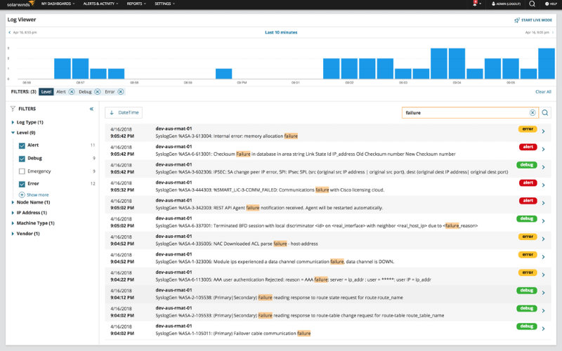
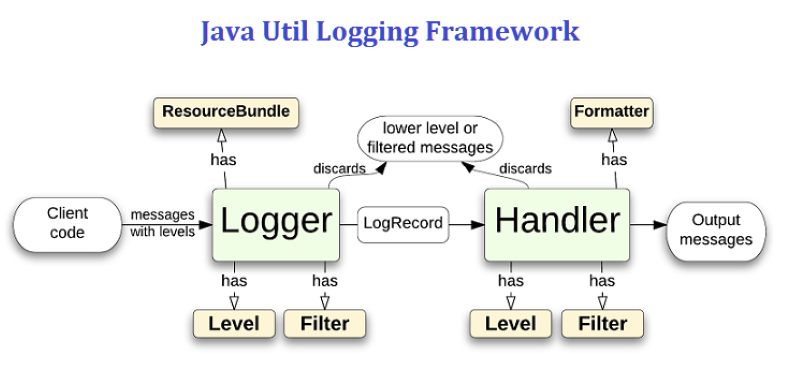

# Java日志框架入门学习



- 日志实现框架
    - [JDK Logging](#JUL)
    - [Log4j / Log4j2](#Log4j)
    - [Logback](#Logback)
- 日志Facade框架
    - [Apache Commons Logging](#JCL)
    - [Slf4j](#Slf4j)

## JUL


[练习项目](projects/jdk_logging_test)

### 笔记
- JDK Logging = JUL
- 原生支持，`java.util.logging.*`
- 日志级别：`OFF`、`SEVERE`、`WARNING`、`INFO`、`CONFIG`、`FINE`、`FINER`、`FINEST`、`ALL`
- 没有提供异步、缓存等优化手段

## Log4j


[Log4j练习项目](projects/log4j_test)

[Log4j2练习项目](projects/log4j2_test)

### 笔记
- Log4j日志级别：`DEBUG`、`INFO`、`WARN`、`ERROR`、`FATAL`
- Log4j引入AsyncAppender做异步日志
- 2020年08月05日Apache宣布Apache1.x寿终正寝，建议升级2.x
- Log4j2主要包含两部分：
    - `log4j-api`：作为日志接口层，用于统一底层日志系统
    - `log4j-core`：作为上述日志接口的实现，是一个实际的日志框架
- Log4j2的配置方式不含`Properties`，只含`XML`、`JSON`、`YAML`，配置文件加载顺序：
    - log4j2-test.json/log4j2-test.jsn
    - log4j2-test.xml
    - log4j2.json/log4j2.jsn
    - log4j2.xml
- Log4j2日志级别：`TRACE`、`DEBUG`、`INFO`、`WARN`、`ERROR`、`FATAL`，还允许自定义日志类别
- Log4j2提供了占位符功能：`logger.debug("error:{}", e.getMessage());`
- Log4j2引入基于LMAX的Disruptor的无锁异步日志来进一步提升异步日志的功能

## Logback


[练习项目](projects/logback_test)

### 笔记
- [Logback官方文档手册](http://logback.qos.ch/manual/)
- Logback日志级别：`TRACE`、`DEBUG`、`INFO`、`WARN`、`ERROR`
- 配置文件读取顺序（默认读取classpath路径下的文件）：
    - logback.groovy
    - logback-test.xml
    - logback.xml
- Logback主要包含三个模块：
    - `logback-core`：基础模块
    - `logback-classic`：Log4j的一个改良版本，完整实现Slf4j的API，便于切换其他日志系统
    - `logback-access`：访问模块与Servlet容器集成通过HTTP来访问日志的功能
- Logback的Logger同样有继承机制

## JCL


[练习项目](projects/jcl_test)

### 笔记
- Apache Commons Logging = JCL
- JCL日志级别：`TRACE`、`DEBUG`、`INFO`、`WARN`、`ERROR`、`FATAL`

### Maven依赖
1.必须添加JCL依赖 

2.引入Log4j需额外引入Log4j

3.引入Log4j2需引入Log4j2，还需引入以下依赖：
```xml
<dependency>
    <groupId>org.apache.logging.log4j</groupId>
    <artifactId>log4j-jcl</artifactId>
    <version>2.12.1</version>
</dependency>
```

4.引入Logback需引入Slf4j，还需引入如下依赖：
```xml
<dependency>
    <groupId>org.slf4j</groupId>
    <artifactId>jcl-over-slf4j</artifactId>
    <version>1.7.26</version>
</dependency>
```

## Slf4j


[练习项目](projects/slf4j_test)

### 笔记
- Slf4j只提供接口，无任何实现（默认用Logback实现）

### Maven依赖
1.引入JUL作为日志实现：
```xml
<dependency>
    <groupId>org.slf4j</groupId>
    <artifactId>slf4j-log4j12</artifactId>
    <version>1.7.30</version>
</dependency>
```

2.引入Log4j作为日志实现：
```xml
<dependencies>
    <dependency>
        <groupId>log4j</groupId>
        <artifactId>log4j</artifactId>
        <version>1.2.17</version>
    </dependency>
    <dependency>
        <groupId>org.slf4j</groupId>
        <artifactId>slf4j-log4j12</artifactId>
        <version>1.7.30</version>
    </dependency>
</dependencies>
```

3.引入Log4j2作为日志实现：
```xml
<dependencies>
    <dependency>
        <groupId>org.apache.logging.log4j</groupId>
        <artifactId>log4j-core</artifactId>
        <version>2.6.2</version>
    </dependency>
    <dependency>
        <groupId>org.apache.logging.log4j</groupId>
        <artifactId>log4j-api</artifactId>
        <version>2.6.2</version>
    </dependency>
    <dependency>
        <groupId>org.apache.logging.log4j</groupId>
        <artifactId>log4j-slf4j-impl</artifactId>
        <version>2.12.1</version>
    </dependency>
</dependencies>
```

4.使用Logback作为日志实现，只需要引入Logback包
